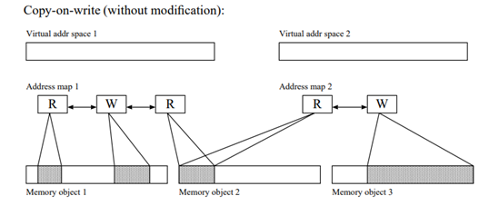
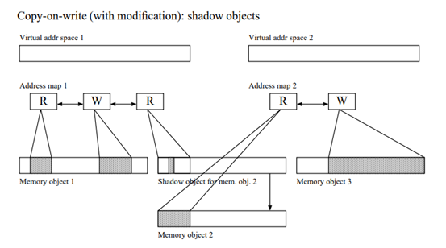
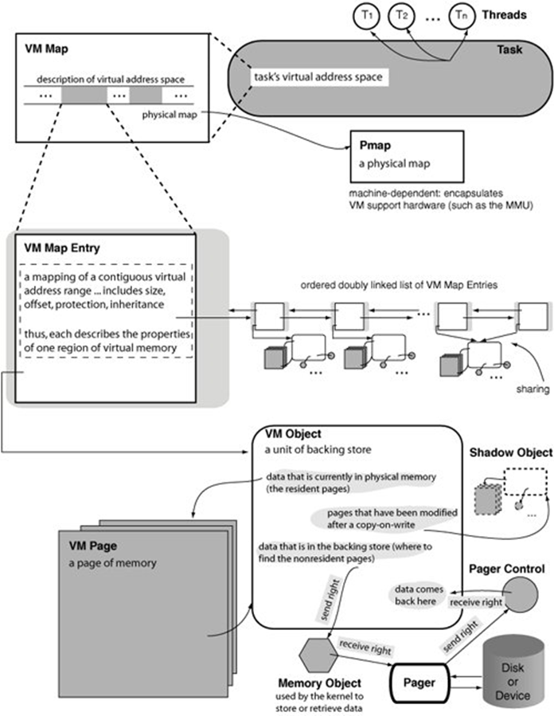

# Mach
## Micro-kernel
Mach 3.0 was technically a µKernel, but prior versions were not since the BSD server was also in the kernel. Mac OS X is based on Mach 3.0, but they’ve also put pretty much everything back in the kernel. 
## Benefits of micro-kernels:
**Obvious benefit**: robustness. If part of the OS misbehaves, it won’t do bad things to the rest of the OS.  
**Further benefit**: user-processes can perform operating system functionality, such as paging. Why on earth would you want this? Well, to change the policy used or employ multiple policies, rather than the one the kernel imposes.
## Critical challenge for micro-kernels: 
Inter-Process Communication (IPC) performance.
## Mach Kernel Abstractions:
Mach provides a small set of abstractions that have been designed to be both simple and powerful. These are the main kernel abstractions:  
-**Tasks.** The units of resource ownership; each task consists of a virtual address space, a port right namespace, and one or more threads. (Similar to a process.)  
-**Threads.** The units of CPU execution within a task.  
-**Address space.** In conjunction with memory managers, Mach implements the notion of a sparse virtual address space and shared memory.  
-**Memory objects.** The internal units of memory management. Memory objects include named entries and regions; they are representations of potentially persistent data that may be mapped into address spaces.  
-**Ports.** Secure, simplex communication channels, accessible only via send and receive capabilities (known as port rights).  
-**IPC.** Message queues, remote procedure calls, notifications, semaphores, and lock sets.  
-**Time.** Clocks, timers, and waiting.
## Ports:
With the exception of the task’s virtual address space, all other Mach resources are accessed through a level of indirection known as a port. A port is an endpoint of a unidirectional communication channel between a client who requests a service and a server who provides the service. If a reply is to be provided to such a service request, a second port must be used. This is comparable to a (unidirectional) pipe in UNIX parlance.  
Tasks have permissions to access ports in certain ways (send, receive, send-once); these are called port rights. A port can be accessed only via a right. Ports are often used to grant clients access to objects within Mach. Having the right to send to the object’s IPC port denotes the right to manipulate the object in prescribed ways. As such, port right ownership is the fundamental security mechanism within Mach. Having a right to an object is to have a capability to access or manipulate that object.  
Port rights can be copied and moved between tasks via IPC. Doing so, in effect, passes capabilities to some object or server.  
Traditionally in Mach, the communication channel denoted by a port was always a queue of messages.  
## Mach VM design:
Main idea: separates virtual address space management from physical memory management (machine-dependent structures and machine-independent structures).  
• **Resident page table**: machine-independent page structures, inverted page table  
• **Address map**: representation of an address space   
• **Memory objects**: a unit of backing storage managed by the kernel or a user task  
• **The pmap**: the machine-dependent structure  

## COW:
   
 
 
## Mach VM Structure:

