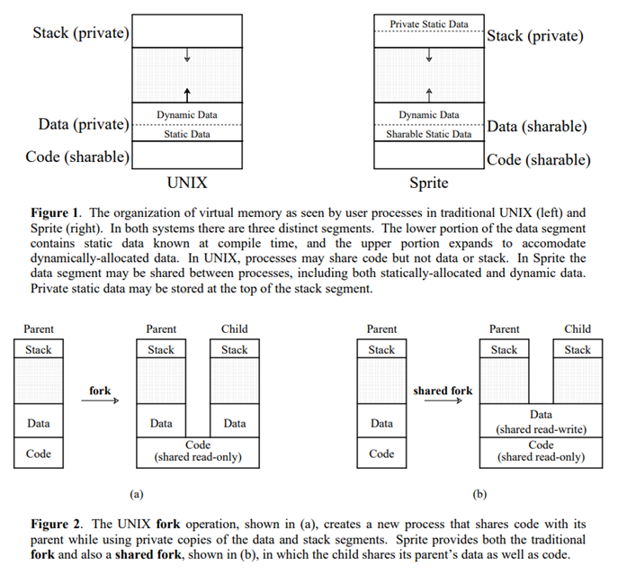
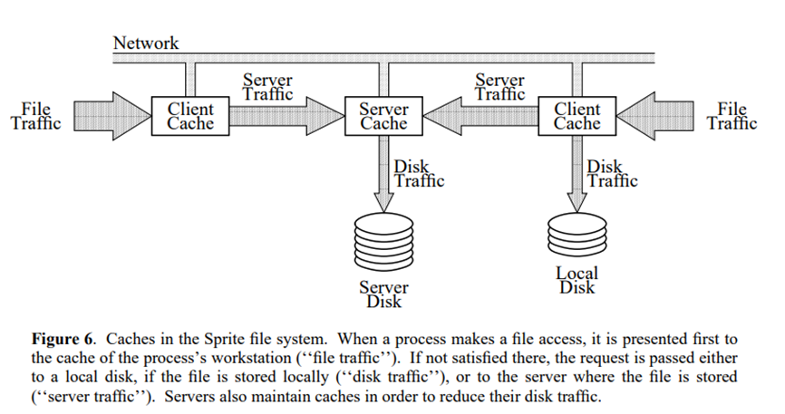

# Sprite  
### Three technology trends at that time:
Network -> “Workstation environments tend to suffer from poor performance and difficulties of sharing and administration, due to the distributed nature of the systems” -> Single global namespace   
Memory -> Caching   
Multiprocessors -> shared heap -> parallelisms (“Shared memory provides the fastest possible communication, hence the greatest opportunity for concurrent execution”)   
 

### Process Migration:
Sprite provides a new kernel call, Proc_Migrate, which will move a process or group of processes to an idle machine. Sprite keeps track of which machines are idle and selects one as the target for the migration. 

### One important usage of process migration: pmake
“We have written a new version of the UNIX make utility, called pmake. Pmake, like make, carries out the recompilation of programs when their source files change. Whereas make invokes the recompilations sequentially, pmake is organized to invoke multiple recompilations concurrently, using process migration to offload the compilations to idle machines.”  

### Aggressive Caching
Caching in the memory of the client. Data blocks of the same file may on multiple machines, and that raises a consistency issue – How to ensure that the file data that is stored on multiple machines is the same? If one machines does a write and another machine does a read, how to make sure that the read sees the latest write?  

### Sprite makes the following arguments:
Consistency is only a problem if you have multiple machines sharing data. There are two scenarios: concurrent sharing and consecutive sharing.   
Sprite handles the consecutive sharing problem with version numbers. Every time a client opens a file from local cache, it checks the version number of that file from the server. The server will tell the client the latest version number. If the cached file is up to date, the client will use it. Otherwise, the client gets the latest file from the server.  
> “Sprite handles sequential write-sharing using version numbers. When a client opens a file, the server returns the current version number for the file, which the client compares to the version number associated with its cached blocks for the file. If they are different, the file must have been modified recently on some other workstation, so the client discards all of the cached blocks for the file and reloads its cache from the server when the blocks are needed. The delayed-write policy used by Sprite means that the server does not always have the current data for a file (the last writer need not have flushed dirty blocks back to the server when it closed the file). Servers handle this situation by keeping track of the last writer for each file; when a client other than the last writer opens the file, the server forces the last writer to write all its dirty blocks back to the server’s cache. This guarantees that the server has up-to-date information for a file whenever a client needs it.”   

The hard part is the concurrent sharing. Since it is an extremely rare case, Sprite just disables it.   
> “For concurrent write-sharing, where the file is open on two or more workstations and at least one of them is writing the file, Sprite disables client caching for that file. When the server receives an open request that will result in concurrent write-sharing, it flushes dirty blocks back from the current writer (if any), and notifies all of the clients with the file open that they should not cache the file anymore. Cache disabling is done on a file-by-file basis, and only when concurrent write-sharing occurs. A file may be cached simultaneously by several active readers.”  
 
