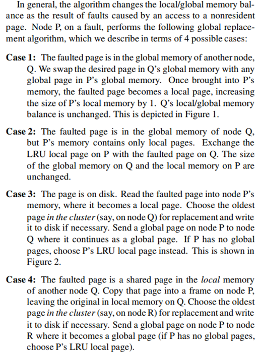
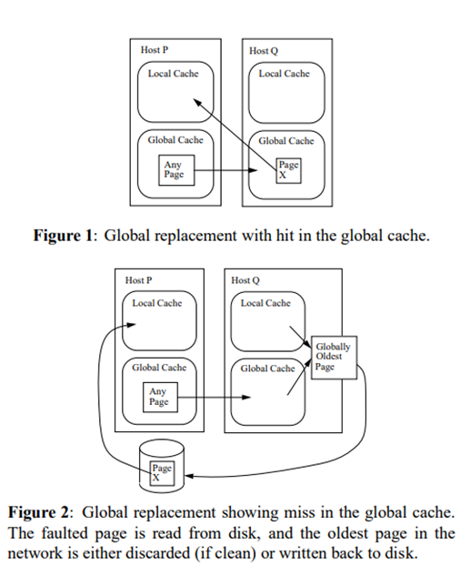

# Global Memory Service (GMS)
### Background of GMS  
A computer cluster: Everyone has a computer on their desk, connected by network.   

### What does GMS do?  
GMS adds another layer to the traditional memory hierarchy.   
Traditional memory hierarchy: Registers, Cache, DRAM, Disk.   
GMS adds a new layer, called global memory, between DRAM and Disk. The idea is when you do eviction from DRAM, the data is stored in global memory.   

### Core Assumptions of GMS
* Trust/Cooperate.   
* Multiplexing.   
* Idle memory.  
* Reliable & fast network.  

### Basic Algorithm

 
### Eviction policy
In GMS, time is divided into epochs.     
At the beginning of each epoch, a coordinator is selected, and each node sends all the age information of their pages to the coordinator. The coordinator will sort the age info and return back to each node.  
We want to use LRU algorithm, but with the time moving forward, and every node is making local decisions, the age information of pages is getting stale.   
The strategy of GMS is, rather than doing individual LRU evictions precisely, GMS will evict N pages during each epoch and make the sum result in the N oldest evictions with high probability.    
#### How?  
At the beginning of each epoch, every node knows the N oldest pages and their location, and every node is storing a fraction of the N oldest pages (The fractions sum up to 1). And when doing an eviction, the active node will use the distribution of old pages on each node as the weight of being chosen to do a random decision.   
Pros of randomized algorithm: Each node can make local decisions without coordinate with others. And the sum achieves the high-level eviction goal.  

##### Further thoughts: Use the idle CPU resource, like doing compression and decompression for pages, so that idle machines can provide more global memory spaces.

