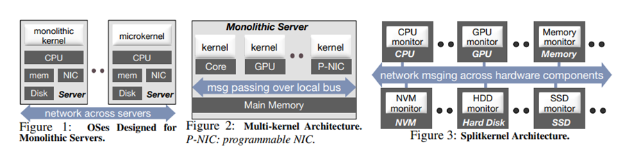

# LegoOS
First OS to implement Hardware disaggregation from scratch.  
The goal of Lego OS is not to improve performance, but to improve utilization.   
 

### Splitkernel
> “The basic idea is simple: When hardware is disaggregated, the OS should be also.”

