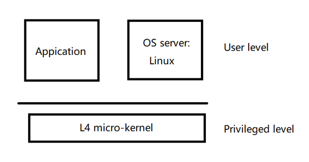

# L4 and Micro-kernel

## Goals of L4
Mach was slow.
**L4 tried to answer this question**: is the performance degradation a fundamental feature of micro-kernel approach, or it is tied to a particular system and its implementation?  
So, they built L4, and it is sensitive to performance. They tried to run L4 as fast as possible.

**Another question**: is co-location* necessary for micro-kernel, or we can just run OS in user level?  
*Co-location: some micro-kernel implementations run OS in the privileged level together with the micro-kernel, in order to gain performance improvement. 

L4 also talks about the benefits of micro-kernels: Specialization and extensibility.  
**Specialization**: Pipes are widely used for IPC, and pipe implementation in Unix is general. The general implementation brings about complexity and overhead. Can a more specialized implementation improve the performance?  
**Extensibility**: Adding new features.  

L4 micro-kernel only has a few small abstractions: threads, address spaces, IPC  

## How L4 works?

](l4.png)

##### See how L4 works from a **system call** example:
1.	The application calls read() function. The read() function of the lib C has been modified to send a message to the Linux server. So, the application calls a “send message” system call of L4, and the destination is the Linux server. L4 delivers this message up into the Linux server.  
2.	Linux handles the read system call inside of Linux and sends a response.   

The L4 paper argues that, it cannot be faster than a normal system call, but the overhead can be fairly low and the benefits are worth it.  

##### See what happens in L4 during a **page fault**:  
1.	The virtual page of application does not have a mapped physical page. The TLB misses, and the hardware (MMU) transfers the control to the L4 kernel.  
2.	The L4 packages up the page fault in a message, and sends the message to the Linux server. Linux handles the page fault, and responses to the L4. L4 then lets the blocked thread run again.  

## Shadow paging
L4 is in charge of address spaces and memory. As a result of this, L4 is responsible for constructing and managing page tables for every process. Whenever there is a context switch, L4 interacts with the hardware to change the current page table to the page table of the new process. 
However, Linux is a operating system, and it thinks it manages the address spaces for all the processes.  

-How to resolve this dilemma?  
-L4 allows Linux to also create page tables. But L4 does not use these page tables in the CPU. Whenever Linux changes a page table, it notifies L4 the change. L4 can verify if the modification is correct. And if correct, L4 applies the change to its own page tables.  
This mechanism is called **shadowing paging**.  

## Conclusions
1. The penalty for using micro-kernels can be kept somewhere between 5% and 10% for applications, compared to a monolithic Linux.   
2. Co-location is not needed.  
3. With specialization, user-level applications on L4 may run even faster than a monolithic operating system.   
